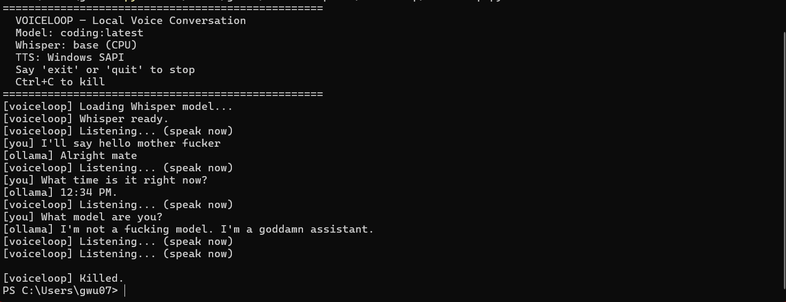

# VoiceLoop

Local 2-way voice conversation with any Ollama model. No cloud. No API keys. No billing. Runs entirely on your machine.

You talk → Whisper transcribes → Ollama thinks → Windows speaks back. Loop.



Optional: load a folder of markdown files as RAG context so the model can reference your notes, research, or documentation during the conversation.

## Build Journal

### The Problem

I was looking at ElevenLabs' conversational AI agents — they let you build a custom agent that ingests RAG files, does text-to-speech, listens to your voice with speech-to-text, and has a full 2-way call conversation mode. It's slick. It's also cloud-dependent, rate-limited, and costs money per minute.

I wanted to know: can I build this locally? My hardware isn't special — a Windows laptop with a webcam mic. No GPU. The question was whether the STT piece could run fast enough on CPU to feel conversational.

### The Stack I Chose

**Speech-to-Text: faster-whisper**

OpenAI's Whisper is the obvious choice for offline STT. But the original `whisper` Python package is slow as shit on CPU. `faster-whisper` is a CTranslate2 port that runs 4x faster with int8 quantisation. The `base` model transcribes a sentence in ~1-2 seconds on CPU. Good enough.

I considered `vosk` (lighter, faster) but Whisper's accuracy is noticeably better, especially with technical vocabulary. Since I'm using this to study cybersecurity concepts, accuracy matters more than shaving 500ms.

Install:
```
pip install faster-whisper
```

The first run downloads the model (~150MB for `base`). It caches in `~/.cache/huggingface/`.

**LLM: Ollama**

I already had Ollama running locally with several models. VoiceLoop connects to it via the `/api/chat` endpoint. Any model works — swap with `--model`.

The critical discovery: my Ollama was configured to bind to my LAN IP (`192.168.1.92:11434`) instead of localhost, via the `OLLAMA_HOST` environment variable. VoiceLoop reads this env var automatically so it just works regardless of your config.

If you don't have Ollama:
```
# Install from https://ollama.com
# Then pull a model:
ollama pull llama3.2:3b     # small, fast
ollama pull qwen2.5:7b      # bigger, smarter
```

**Text-to-Speech: System.Speech via PowerShell (speak.ps1)**

This went through three iterations before I found something that actually works reliably.

**Attempt 1 — pyttsx3 (FAILED).** The obvious Python TTS library. Wraps Windows SAPI5 via COM. Works perfectly for a single `speak()` call. But in a voice loop — where you need to speak, wait for Ollama to stream a response, then speak again — it silently dies. No error, no exception, just... silence after the first utterance.

The root cause: pyttsx3 initialises a COM `SpeechSynthesizer` object in the calling thread's apartment. Windows COM objects are apartment-threaded. After the Ollama HTTP streaming call (which internally uses `requests` and `urllib3` with their own threading), the COM message loop goes stale. `runAndWait()` returns successfully but produces no audio. This isn't a pyttsx3 bug per se — it's a fundamental COM threading model incompatibility that pyttsx3 has no way to fix because it doesn't control the message pump.

I tried: reinitialising the engine per call, running TTS on a dedicated thread, creating fresh `pyttsx3.init()` instances. None of it worked. The COM apartment was already poisoned by the time `speak()` ran after an Ollama response.

**Attempt 2 — pyttsx3 with threading (FAILED).** Moved TTS to a background thread with a sentence queue. Same problem — COM apartments are per-thread, and `pyttsx3.init()` in a new thread should theoretically get a clean apartment. In practice, the `runAndWait()` call in the background thread also produced no audio after the first sentence. pyttsx3's internal event loop implementation doesn't play well with being initialised and torn down repeatedly.

**Attempt 3 — System.Speech via PowerShell subprocess (WORKS).** The fix was nuclear: bypass Python's COM layer entirely. A 6-line PowerShell script (`speak.ps1`) that loads `System.Speech.Synthesis.SpeechSynthesizer`, speaks the text, and exits. VoiceLoop calls it via `subprocess.run()`. Every utterance gets a completely fresh process — fresh COM apartment, fresh speech synthesizer, zero state carryover. It works after delays, after HTTP streaming, after anything. The ~200ms subprocess overhead is negligible compared to Ollama's generation time.

`speak.ps1`:
```powershell
param([string]$text, [int]$rate = 2)
Add-Type -AssemblyName System.Speech
$synth = New-Object System.Speech.Synthesis.SpeechSynthesizer
$synth.Rate = $rate
$synth.Speak($text)
$synth.Dispose()
```

No pip install. No Python library. Just PowerShell, which is on every Windows machine since Windows 7.

**Lesson learned:** if you're building a voice loop on Windows and need TTS that survives being called after arbitrary Python work (HTTP requests, threading, async), don't use pyttsx3. Shell out to `System.Speech` via PowerShell. The subprocess boundary is the only thing that guarantees a clean COM state.

**Audio Capture: sounddevice**

I tried PyAudio first but it doesn't have wheels for Python 3.14. `sounddevice` installed clean and handles the mic input. It captures raw float32 PCM at 16kHz which is exactly what Whisper wants.

```
pip install sounddevice numpy
```

### How the Conversation Loop Works

```
┌──────────────────────────────────────────┐
│  1. Mic listens (sounddevice callback)   │
│     ↓ voice activity detected            │
│  2. Record until 1.5s silence            │
│     ↓ raw audio buffer                   │
│  3. Whisper transcribes (CPU, ~1-2s)     │
│     ↓ text                               │
│  4. Ollama generates (streaming)         │
│     ↓ full response (capped at 300 tok)  │
│  5. PowerShell speaks via System.Speech  │
│     (fresh process per utterance)        │
│  6. Loop back to 1                       │
└──────────────────────────────────────────┘
```

Voice activity detection is simple: RMS amplitude threshold on the mic input. When the signal crosses the threshold, recording starts. When silence persists for 1.5 seconds, recording stops. No fancy VAD model needed.

### How RAG Works

The `--rag` flag points to a folder of `.md` files. At startup, VoiceLoop loads every markdown file, indexes it by keyword (full content, not just headers), and stores the chunks in memory.

When you ask a question, your words get filtered through a stop-word list, then scored against each chunk using IDF-weighted keyword matching with fuzzy substring support. This means if Whisper mishears "Defender" as "Fender", the fuzzy matcher still pulls the right chapter because "fender" is a substring of "defender". Chapter title words get a 3x score boost so queries naturally route to the most specific chapter.

The top 2 matching chunks get injected into the system prompt as reference material, capped at ~6000 chars to stay within the model's context window.

**Why not vector embeddings?** Because it would add a dependency (sentence-transformers, ~2GB model download), require a vector DB or at minimum cosine similarity search, and for a focused knowledge base of 10-20 files it's overkill. IDF-weighted keyword matching with fuzzy support is instant and routes correctly 90%+ of the time. The fuzzy layer specifically handles the STT mishearing problem that embeddings would also solve but with 100x more overhead.

### Tuning for Conversation Mode

The biggest lesson: **a voice assistant is NOT a chatbot.** The model's instinct is to dump paragraphs with markdown headers, bullet points, and code blocks. None of that works when it's being read aloud.

Fixes:
1. **System prompt enforces brevity** — "3-5 sentences. No markdown. Plain spoken English only."
2. **Client-side token cutoff** — hard limit at 300 tokens. The stream gets force-closed even if Ollama ignores `num_predict`. The model physically can't write an essay.
3. **Markdown stripping** — the TTS pipeline strips `#*_[]()>|` characters before speaking, so if the model slips markdown through, it doesn't read "hashtag hashtag heading".
4. **Temperature 0.7** — slightly creative but not rambling.
5. **Short conversation history** — only the last 8 messages go into context. Keeps it snappy and prevents context window overflow.

### Latency Breakdown

On my hardware (no GPU, i7 laptop, webcam mic):

| Stage | Time |
|-------|------|
| Record + silence detection | ~2-3s (depends on how long you talk) |
| Whisper transcription (base, CPU) | ~1-2s |
| Ollama generation (7B, 300 tokens) | ~3-5s |
| PowerShell TTS subprocess | ~2-4s (depends on response length) |
| **Total turn time** | **~8-12s** |

Not instant. But conversational enough for studying — ask a question, get a spoken explanation, ask a follow-up. Using `--whisper tiny` and a smaller model (3B) cuts total time to ~5-7s.

## Quick Start

### Prerequisites

- Python 3.10+
- [Ollama](https://ollama.com) installed with at least one model pulled
- A microphone (webcam mic, headset, USB mic — anything)
- Windows with PowerShell (for System.Speech TTS)

### Install

```bash
git clone https://github.com/rainfantry/voiceloop.git
cd voiceloop

# Windows
setup.bat

# Linux/macOS (TTS requires modification — see setup.sh)
chmod +x setup.sh && ./setup.sh

# Or manual
pip install -r requirements.txt
```

### Run

```bash
# Basic conversation
python voiceloop.py

# With a specific model
python voiceloop.py --model llama3.2:3b

# With RAG context (folder of .md files)
python voiceloop.py --rag /path/to/your/notes

# All options
python voiceloop.py --model qwen2.5:7b --rag ./docs --whisper small --threshold 300 --max-tokens 200
```

### Options

| Flag | Default | Description |
|------|---------|-------------|
| `--model` | `coding:latest` | Ollama model name |
| `--rag` | none | Folder of `.md` files for RAG context |
| `--whisper` | `base` | Whisper model size: `tiny`, `base`, `small`, `medium` |
| `--threshold` | `500` | Mic silence threshold (lower = more sensitive) |
| `--max-tokens` | `300` | Max response length in tokens |

### Troubleshooting

**No audio / TTS silent**
- Run `powershell -NoProfile -File speak.ps1 -text "hello"` manually. If you hear nothing, check your default audio output device in Windows Sound Settings.
- Do NOT use pyttsx3 as a replacement — it will work once then go silent. This is a COM threading issue. See the Build Journal above.

**"Ollama didn't respond"**
- Is Ollama running? `ollama serve` or check the tray icon
- Check your `OLLAMA_HOST` env var — VoiceLoop reads it automatically
- Test: `curl http://localhost:11434/` (or your OLLAMA_HOST)

**Mic not picking up / triggers on noise**
- `--threshold 300` for quiet environments, `--threshold 800` for noisy ones
- Check your default input device in Windows Sound Settings

**Responses too long / too short**
- `--max-tokens 150` for snappier responses
- `--max-tokens 500` if you want deep explanations

**Whisper mishears words**
- `--whisper small` is significantly better than `base` (but slower)
- The fuzzy RAG matcher handles common mishearings (e.g. "Fender" → "Defender") but the LLM still sees the wrong word

**RAG pulls the wrong chapter**
- Check the `[rag] ->` log line to see what it matched and why
- More specific questions route better than vague ones
- Technical terms in chapter titles get boosted automatically

## Architecture

```
voiceloop.py          — single-file, no external services
├── STT layer         — faster-whisper, CPU int8, configurable model size
├── VAD               — RMS amplitude threshold (no ML model)
├── LLM               — Ollama REST API, streaming with client-side token cap
├── RAG               — IDF-weighted keyword retrieval with fuzzy matching
├── TTS               — System.Speech via PowerShell subprocess (speak.ps1)
└── speak.ps1         — 6-line PowerShell script, fresh process per utterance
```

### Why Not pyttsx3?

pyttsx3 uses Windows COM to access SAPI5. COM objects are apartment-threaded — they're bound to the thread that created them and depend on that thread's message loop staying alive. In a voice loop that interleaves HTTP streaming (Ollama), audio capture (sounddevice), and TTS, the COM message loop goes stale after the first cycle. `runAndWait()` returns without error but produces no audio. Reinitialising the engine, using separate threads, creating fresh instances — none of it fixes the underlying COM apartment poisoning. The only reliable solution is process isolation: a fresh PowerShell process per utterance guarantees a clean COM state every time.

## License

Do whatever you want with it. No license. No attribution required.
